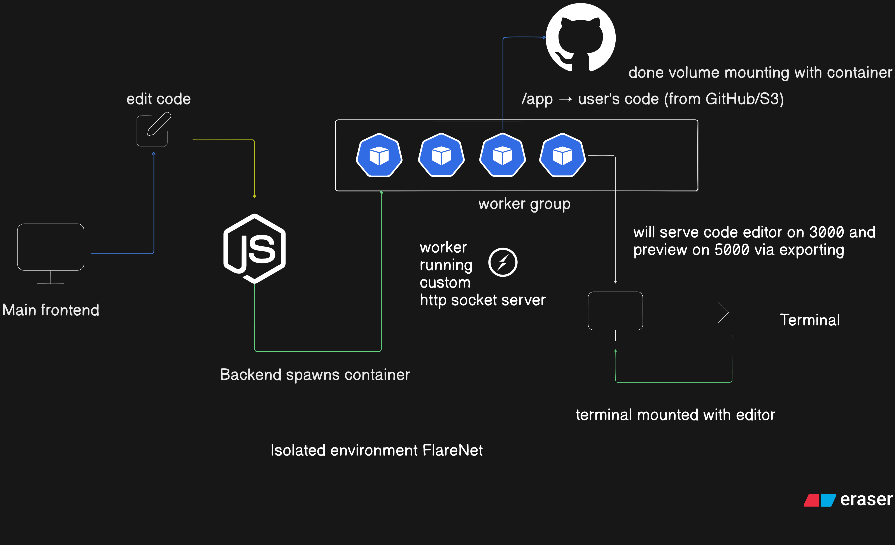

# Flarenet Isolated Editing Environment

A containerized environment for isolated, live editing of web applications with real-time preview.

## Architecture



## Features

- Monaco Editor for code editing (on port 3000)
- Live preview of the application (on port 5000)
- Terminal integration for running commands directly in the environment
- File system explorer for easy navigation
- Support for multiple source options:
  - Local directory mounting
  - Git repository cloning
  - S3 bucket downloading
- Code syncing back to source (local directory, Git, or S3)
- Automatic rebuild and restart of preview on file changes
- Fully isolated per user/project
- Resource limiting and container management

## Quick Start

### Using Docker Compose

1. Copy the example environment file:

```bash
cp env.example .env
```

2. Edit the `.env` file with your configuration:

```
USER_ID=user123
PROJECT_ID=project456
SOURCE_TYPE=local
SOURCE_PATH=./my-source-code
```

3. Run the container:

```bash
docker-compose up -d
```

4. Access the editor at http://localhost:3000 and the preview at http://localhost:5000

### Using Docker directly

```bash
docker run -d \
  -p 3000:3000 -p 5000:5000 \
  -v $(pwd)/my-source-code:/source \
  -e USER_ID=user123 \
  -e PROJECT_ID=project456 \
  --name flarenet-editor-user123 \
  flarenet-editor
```

## Project Structure

```
Flarenet Isolated env/
├── assets/                  # Static assets
│   └── arch.png             # Architecture diagram
├── docker-compose.yml       # Docker Compose configuration
├── Dockerfile               # Container definition
├── editor/                  # Monaco editor implementation
│   ├── package.json         # Editor dependencies
│   ├── public/              # Static web files
│   │   ├── css/             # Stylesheets
│   │   ├── index.html       # Editor HTML entry point
│   │   └── js/              # Client-side JavaScript
│   └── server.js            # Editor backend server
├── env.example              # Example environment variables
├── README.md                # This documentation
├── scripts/                 # Utility scripts
│   ├── rebuild-preview.sh   # Rebuild the preview environment
│   ├── setup.sh             # Initial setup script
│   ├── start-services.sh    # Start all services
│   └── sync-code.sh         # Sync code changes
└── source/                  # Default source code directory
    └── index.html           # Default source entry point
```

## Configuration Options

### Environment Variables

| Variable | Description | Default |
|----------|-------------|---------|
| USER_ID | Unique user identifier | default |
| PROJECT_ID | Unique project identifier | default |
| SOURCE_TYPE | Source code location type (local, git, s3) | local |
| SOURCE_PATH | Path to local source directory | ./source |
| GIT_REPO | Git repository URL | |
| GIT_BRANCH | Git branch to clone | main |
| GIT_USERNAME | Git username for private repos | |
| GIT_TOKEN | Git token for private repos | |
| AUTO_SYNC | Enable automatic syncing of changes | false |
| SYNC_INTERVAL | Interval in seconds for auto sync | 60 |
| S3_BUCKET | S3 bucket name | |
| S3_KEY | S3 object key prefix | |
| AWS_ACCESS_KEY | AWS access key | |
| AWS_SECRET_KEY | AWS secret key | |
| EDITOR_PORT | Port for Monaco editor | 3000 |
| PREVIEW_PORT | Port for application preview | 5000 |
| CPU_LIMIT | CPU limit for the container | 1 |
| MEMORY_LIMIT | Memory limit for the container | 1G |

## Building the Image

```bash
docker build -t flarenet-editor .
```

## System Components

1. **Monaco Editor**: A web-based code editor running on port 3000
2. **Preview Server**: Serves the application on port 5000
3. **File Watcher**: Monitors file changes for live reload
4. **Sync Service**: Synchronizes changes back to source
5. **Terminal Service**: Provides command-line access within the container

## Extending the Environment

### Adding Custom Dependencies

Edit the Dockerfile to add custom dependencies:

```dockerfile
# Add custom dependencies
RUN apk add --no-cache your-package
```

### Supporting Additional Languages/Frameworks

For specialized language support, you may need to modify the Dockerfile and scripts.

## Security Considerations

- The container runs as a non-root user
- Resource limits prevent container abuse
- Isolated network namespaces keep environments separate
- Git/S3 credentials are stored securely as environment variables

## Scripts

- **rebuild-preview.sh**: Rebuilds the preview environment after code changes
- **setup.sh**: Performs initial setup of the environment
- **start-services.sh**: Starts all required services
- **sync-code.sh**: Synchronizes code changes back to the source

## License

MIT 